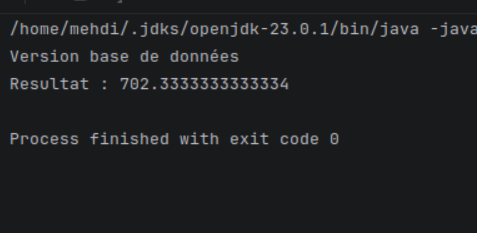

# Inversion de Contrôle et Injection de Dépendances

## Présentation

Ce projet est un exemple simple pour comprendre l'**inversion de contrôle (IoC)** et l'**injection de dépendances** en Java. C'est un concept très important dans les architectures JEE et Spring.

L'idée principale : au lieu qu'une classe crée elle-même les objets dont elle a besoin (avec `new`), on lui **donne** ces objets depuis l'extérieur. Cela rend le code plus flexible et plus facile à modifier.

## Structure du projet

```
src/main/java/
├── dao/
│   ├── IDao.java        → interface de la couche accès aux données
│   └── DaoImpl.java      → implémentation qui simule une base de données
├── ext/
│   └── DaoImplV2.java    → autre implémentation, simule un web service
├── metier/
│   ├── IMetier.java      → interface de la couche métier
│   └── MetierImpl.java   → contient la logique de calcul
├── pres/
│   ├── Pres1.java        → point d'entrée avec injection statique
│   └── Pres2.java        → point d'entrée avec injection dynamique
└── config.txt            → fichier de configuration utilisé par Pres2
```

## Les trois couches du projet

Le projet est organisé en couches, comme dans une vraie application JEE :

1. **Couche DAO** (`dao`) : gère l'accès aux données. L'interface `IDao` définit une méthode `getData()`. Deux classes l'implémentent différemment : `DaoImpl` (simule une base de données) et `DaoImplV2` (simule un web service).

2. **Couche Métier** (`metier`) : contient la logique de calcul. La classe `MetierImpl` utilise l'interface `IDao`, mais **ne connaît pas** quelle implémentation exacte elle utilise. C'est ça, le couplage faible.

3. **Couche Présentation** (`pres`) : c'est ici que tout démarre. C'est cette couche qui décide quelle implémentation utiliser, et qui l'injecte dans la couche métier.

## Deux façons d'injecter les dépendances

### 1. Injection statique (`Pres1.java`)

On crée les objets directement dans le code avec `new`, puis on les passe au constructeur :

```java
DaoImpl d = new DaoImpl();
MetierImpl metier = new MetierImpl(d);
System.out.println("RES=" + metier.calcul());
```

**Inconvénient** : si on veut changer d'implémentation (par exemple utiliser `DaoImplV2`), il faut modifier le code source et recompiler.

### 2. Injection dynamique (`Pres2.java`)

On utilise la **réflexion Java** (`Class.forName`) pour lire le nom des classes à utiliser depuis un fichier externe `config.txt` :

```
dao.DaoImpl
metier.MetierImpl
```

Le programme lit ce fichier et crée les objets automatiquement, sans savoir à l'avance quelle classe sera utilisée.

**Avantage** : pour changer d'implémentation, il suffit de modifier le fichier `config.txt` (par exemple mettre `ext.DaoImplV2` à la place de `dao.DaoImpl`). **Aucune recompilation n'est nécessaire.**

## Pourquoi c'est important ?

Ce principe est la base du fonctionnement de **Spring Framework**. Spring fait exactement la même chose que `Pres2`, mais de manière beaucoup plus complète : il lit un fichier de configuration (XML ou annotations) et crée automatiquement les objets nécessaires, en les injectant là où il faut.

Comprendre ce mécanisme "à la main" permet de mieux comprendre comment Spring fonctionne en interne.

## Comment exécuter le projet

### Avec Maven

```bash
mvn compile
mvn exec:java -Dexec.mainClass="pres.Pres1"
```

ou pour la version dynamique :

```bash
mvn exec:java -Dexec.mainClass="pres.Pres2"
```

### Avec IntelliJ

Ouvre le projet, clique droit sur `Pres1.java` ou `Pres2.java`, puis choisis **Run**.




## Auteur

Projet réalisé dans le cadre du module Architecture JEE et Systèmes Distribués